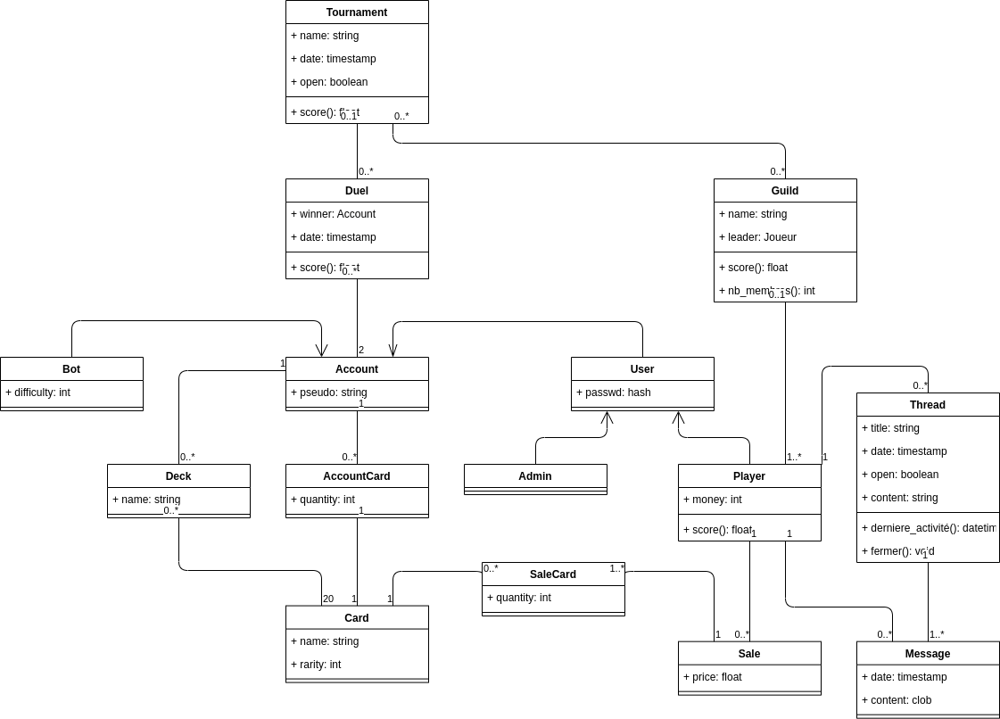

# Natural the Scattering

by Peons of the Barn

🛑 🚧 Work-in-Progress 🚧

---

# Rapport de projet :

Natural the Scattering

GAILLARD Julian, PESME Bastien, BERNABE Jimmy

Introduction
============

Ce projet s'inscrit dans le cadre de notre cursus ingénieur, il porte
sur la création d'une application en ligne afin d'approfondir les
notions vues en cours en les appliquant sur un cas concret.

Pour répondre à cette problématique, nous avons conçu Natural the
Scattering, un jeu de cartes en ligne inspiré à l'origine par des jeux
comme Magic the Gathering.

Ce rapport présente les différentes fonctionnalités de cette
application, ainsi que son architecture, nous verrons également les
divers outils employés afin de mener ce projet à bien.

Présentation
============

Natural the Scattering est donc un jeu de cartes se jouant entre deux
joueurs et en ligne.

Dans le cas nominal d'une partie, les deux joueurs se connectent à un
site web, à partir duquel ils peuvent démarrer un duel. Le serveur les
met alors en relation et la partie de cartes commence. Les deux joueurs
jouent au tour par tour jusqu'à ce qu'un des deux joueurs soit déclaré
vainqueur.

Gameplay
--------

Puisque pour arriver à produire un véritable jeu, il serait nécessaire
d'avoir des talents de game designer, il a été décidé de produire une
application avec un moteur de jeu suivant des règles de jeu allégées et
en créant des cartes copiant les déplacements des pions d'échecs
puisque, comme nous allons le voir, le jeu se déroule sur un plateau.

Un duel se déroule donc sur une grille de cinq lignes par cinq colonnes.
Les deux premières lignes devant chaque joueur représentent sa zone
d'invocation. La ligne centrale est donc neutre.

Au début d'une partie, les deux joueurs ont une pile de vingt cartes
chacun, et une capacité de cinq points d'invocation. Ils ont également
une barre de vie qui met fin à la partie lorsqu'elle est entièrement
vidée.

Les joueurs jouent au tour par tour. A chacun de ces tours, le joueur
pioche une carte qui ira dans sa main, et peut effectuer trois actions
différentes : il peut placer une carte de sa main dans sa zone
d'invocation en payant le coût d'invocation de la carte, il peut
déplacer une carte selon un motif propre à chaque carte, et il peut
attaquer une carte adverse ou le joueur adverse selon un motif, là aussi
propre à chaque carte.

Chaque carte ne peut bouger et n'attaquer qu'une seule fois par tour. En
revanche, le joueur n'est pas obligé de faire bouger ou attaquer toutes
les cartes sur le plateau. Il peut également invoquer plusieurs cartes
de sa main, tant qu'il a assez de points d'invocation pour payer chaque
carte placée.

Une fois qu'il a fini son tour, c'est au joueur adverse de jouer. Lui
aussi peut effectuer les mêmes actions. Lorsqu'il parvient à détruire
une des cartes invoquées du joueur, celle-ci va au cimetière, et le
joueur (celui qui a perdu une carte) gagne un point d'invocation.

La partie se termine lorsque l'un des deux joueurs réussit à infliger
suffisamment de dégâts à l'autre joueur pour que celui-ci n'ait plus de
vie.

Aspects jeu de cartes
---------------------

Puisque Natural the Scattering est un jeu de cartes, il y a plusieurs
fonctionnalités nécessaires au bon fonctionnement d'une partie.

### Authentification

Chaque joueur doit se connecter au serveur, puisque, par exemple, sa
collection de cartes est liée à son compte.

Le joueur doit donc créer un compte s'il n'en a pas ou se connecter à
celui qu'il a déjà. Il doit donc fournir un nom d'utilisateur (unique
parmi tous les joueurs) et un mot de passe qui sera stocké haché dans la
base de données afin de prévenir d'éventuelles fuites de données.

### Booster

Le premier moyen d'obtenir de nouvelles cartes et via un système
d'ouverture de booster. Pour ce faire, le joueur doit posséder un
certain nombre d'argent fictif ce qui lui permet d'ouvrir un booster qui
lui donne cinq cartes aléatoires.

Il faut savoir que chaque carte possède une rareté qui lui est propre
est qu'un système de poids est fait pour que les cartes les plus rares
soient plus dures à obtenir avec les boosters avec un taux d'apparition
plus faible.

Cette page comporte seulement un bouton qui, une fois appuyé et après
vérification que le joueur puisse ouvrir un booster, affiche les cinq
cartes obtenues.

### Collection

L'onglet collection permet à un joueur de consulter ses cartes. Il y
trouvera une liste de toutes les cartes existant dans le jeu. Ces cartes
seront grisées par défaut. Les *id* des cartes associées à son compte
seront alors utilisées afin de dégriser les emplacements correspondants.

Ce menu n'est pas essentiel d'un point de vue gameplay, il permet
uniquement aux personnes souhaitant collectionner les cartes de vérifier
l'avancement de leur collection.

Les joueurs peuvent également vérifier les statistiques et les attributs
de cartes qu'ils possèdent tels que leur valeur d'attaque, de vie, leur
coût d'invocation ou leurs patterns de déplacement et d'attaque. L'image
et la description d'une carte deviennent également disponibles
uniquement une fois que cette carte est possédée par le joueur.

Les cartes grises ne présentent donc qu'un nom.

### Deck

Afin de pouvoir participer à un duel, chaque joueur doit posséder au
moins un deck de vingt cartes. Un deck par défaut sera fourni à tout
nouveau joueur, celui-ci est libre de la modifier ou d'en créer un
nouveau.

L'onglet deck est l'interface sur laquelle ces changements ont lieu, il
est possible d'y consulter les decks déjà associés à un compte via leur
id, les modifier, les supprimer, ou entrer dans l'onglet de création du
deck.

Lors de la création d'un deck, le joueur accède à toutes les cartes
qu'il possède ainsi qu'à leur nombre d'exemplaires, afin de remplir
cette liste de cartes, l'*id* unique d'une carte est utilisée pour
l\'afficher, puis, une *id* d'instance de classe est créée lorsqu'un
exemplaire est utilisée dans un deck. Il accède également à une liste
d\'exemplaires de cartes déjà présentes dans le deck.

L'onglet de création de cartes présente un moteur de recherche afin de
chercher des cartes par nom, mais également des checkbox prévues afin de
filtrer les cartes par types, comme par exemple des cartes avec
certaines capacités spéciales ou certains patterns de déplacement ou
d'attaque particuliers. Puisque ces spécificités ne sont pas
implémentées, les checkbox n'ont actuellement aucun effet. L'idée
d'ajouter des critères de tri tels que par coût d'invocation ou par
valeur d'attaque a également été émise.

Il est possible d'utiliser plusieurs fois la même carte dans un deck,
tant que ce deck comporte effectivement vingt cartes et que le joueur
possède suffisamment d\'exemplaires de la carte en question.

Lorsque l'utilisateur presse le bouton créer, si son deck est de la
taille désirée, il recevra un nouvel *id* unique et sera associé au
compte de cet utilisateur.

Pour modifier un deck, l'utilisateur retourne sur l'écran de création de
deck avec le deck déjà formé. Il est possible de retirer des cartes en
cliquant dessus afin d'en ajouter ensuite des nouvelles. Lorsqu'un deck
est modifié, il garde son *id*, mais la liste des vingt id d'instance de
classe de carte associée au deck est modifiée.

À l\'heure actuelle, seule l'interface utilisateur à été implémentée.

### Duel

Comme dit plus tôt, une partie se déroule sur une grille de cinq lignes
et cinq colonnes. Chaque joueur commence avec 5 points d'invocation et
une pioche de 20 cartes.

Le déroulement d'une partie a été découpé en 4 étapes : ***QUERY***,
***DECK***, ***ACTION*** et ***END***.

***QUERY*** est la première étape, dans celle-ci, le client va demander
au serveur de démarrer une partie avec un adversaire. Le joueur peut
fournir des détails, comme s'il veut affronter un bot, ou jouer dans un
tournoi. Une fois que le serveur a trouvé deux joueurs "compatibles", il
va passer à l'étape suivante.

Dans l'étape ***DECK***, le serveur va demander à chaque joueur de lui
indiquer avec lequel de leur deck ils souhaitent jouer. Le deck aura été
composé auparavant avec l'interface dédiée.

Ensuite, le serveur va désigner le premier joueur et passer à l'étape
***ACTION***. Dans cette étape, le joueur actif va pouvoir effectuer
plusieurs actions : pouvoir piocher, parachuter une carte, en bouger une
autre, ou encore attaquer.

Lorsque le joueur a terminé toutes les actions qu'il souhaitait faire
durant son tour, il y met fin et on passe à l'étape ***END***. Le
serveur vérifie alors l'état de la partie, si un joueur a vaincu. Si
aucune victoire n'a été formulée, le joueur inactif devient actif et
vice-versa, et on repasse à l'étape ***ACTION***.

Aspects sociaux
---------------

L'application reposant également sur un aspect social, plusieurs
fonctionnalités viennent servir cet aspect.

### Amis

L'application supporte également un système d'ami, un onglet permet
d\'accéder à la liste des amis enregistrés dans un compte.

Cette liste permet de voir le pseudonyme et l'image de profil de ses
amis, de vérifier si un ami est connecté, le score personnel qu'il a
accumulé au fil de ses combats.

Bien que cet écran ne soit pas encore implémenté, il devait, en outre,
permettre d\'accéder à un résumé des dernières batailles d'un ami en
particulier.

Pour finir, des boutons sont disponibles afin de défier amicalement un
ami en duel, ou de communiquer avec lui en entrant dans un chat
personnel.

Pour le moment, il suffit d'ajouter un *id* pour avoir un autre
utilisateur dans sa liste d'amis, ultérieurement, un système de demande
d'ami sera conçu avec des requêtes qui doivent être acceptées par
l'autre joueur.

### Guilde

L'onglet guilde partage quelques similarités avec l'onglet ami, le
principal avantage que présente l'admission à une guilde est la
possibilité de participer à des tournois inter-guilde.

De la même manière que pour les amis, l'onglet affiche une liste de
membres de la guilde en présentant leur pseudonyme, image de profil, un
score personnel dissocié du score de guilde et une icône indiquant si la
personne est en ligne ou non.

Il est prévu d'être possible de consulter des résumés de batailles
récentes pour chaque membre, ainsi que de demander un membre de la
guilde en amis.

De plus, cet onglet permet de consulter le score d'une guilde, score
utile pour classer la guilde lors de tournois, ainsi que de consulter
rapidement le nombre de personnes connectées en montrant et le nombre de
membres total présent dans la guilde.

Il est intéressant de noter que le chef de guilde est indiqué dans cette
liste à l'aide d'une icône de drapeau rouge, le chef d'une guilde est la
personne à l'origine de sa création, contrairement aux autres membres,
il a la possibilité de modifier le nom de sa guilde et de la dissoudre.

Pour le moment, chaque joueur est libre de rejoindre ou de quitter une
guilde en un bouton, de même que pour les amis, il est prévu d'ajouter
un système de requête pour rejoindre une guilde qui doit être acceptée
soit par le chef de guilde, soit éventuellement par une personne
accréditée par ce dernier à l'aide d'un système de rôle au sein de la
guilde.

Chaque joueur ne peut faire partie que d'une seule guilde à la fois, si
quelqu'un souhaite rejoindre une nouvelle guilde ou en créer une, il
doit d'abord quitter celle à laquelle il appartient.

### Forum

Le côté communautaire de l'application est très important, de ce fait,
un système de forum a été pensé pour pouvoir échanger facilement des
différents éléments du jeu avec d'autres joueurs.

Il est possible de créer des threads qui sont des pages spécifiques où
chaque personne peut répondre à une question posée ou tout simplement
pour discuter d'un élément de gameplay ou d'une carte par exemple.

Chaque thread est "ouvert" par défaut (il peut recevoir des réponses),
cependant du fait que certains cas comme un thread qui peut devenir trop
vieux en étant sans réponse depuis plusieurs années, il est nécessaire
de pouvoir fermer le thread pour éviter de déterrer un sujet qui n'est
plus d'actualité. De même avec des threads où la question a déjà été
répondue. L'auteur peut aussi choisir de fermer un thread à tout moment.

Chaque thread possède un titre, une date et un auteur.

Chaque réponse dans le thread indique aussi qui est l'auteur pour
pouvoir identifier plus facilement la personne avec qui elle parle, la
date pour savoir si le sujet n'est pas trop vieux et risque d'être
archivé et le contenu.

Pour ajouter un message, il suffit de l'écrire dans la zone dédiée en
bas de la page et d'appuyer sur le bouton *"submit"* pour qu'il soit
ajouté en dessous du dernier message posté.

Les threads clos seront archivés et il sera possible de les lire,
cependant, il sera impossible d'y répondre.

### Hôtel de vente

L'hôtel de vente est le dernier onglet de la partie communauté. Il
permet à chaque joueur de poster des annonces portant sur la mise en
vente d'une de leurs cartes contre la monnaie fictive du jeu.

Cet onglet représente un moyen alternatif aux boosters pour obtenir des
cartes, il a l'avantage de montrer quelle carte l'acheter va obtenir
plutôt que de se baser sur le hasard.

Pour que les recherches soient plus pratiques pour les joueurs cherchant
une carte en particulier, chaque annonce concerne un seul type de carte,
si un utilisateur veut vendre plus d'une carte différente, il devra
poster plusieurs annonces.

Tout comme pour la création de deck, un moteur de recherche est
disponible pour entrer le nom de la carte recherché et des checkboxs
permettent de filtrer les cartes par type.

Chaque annonce met en avant deux informations : la carte proposée et le
pseudo de l'utilisateur qui a posté l'annonce.

Lorsqu'un joueur est intéressé par une annonce, il peut entrer en
contact avec la personne qui l'a postée. Cette personne va alors
proposer un prix et l'acheteur aura la possibilité d'accepter et
d\'échanger sa monnaie contre la carte, de refuser et mettre fin à
l'échange ou de négocier en proposant un nouveau prix. Afin d'éviter le
spam, l'acheteur peut négocier jusqu'à trois fois après quoi, il doit
accepter ou refuser l'échange.

Si un utilisateur le désire, il peut à tout moment supprimer une annonce
qu'il a postée.

Architecture
============

Maintenant que les différentes fonctionnalités de l'application ont été
détaillées, il faut maintenant réfléchir à son architecture.

Classes
-------

Toutes les fonctionnalités mentionnées plus tôt nécessitent de définir
des tables dans la base de données pour y enregistrer toutes les
informations nécessaires.

Pour commencer, l'authentification nécessite que le nom d'utilisateur et
le mot de passe haché soient stockés. Une classe ***Account*** est
associée aux cartes appartenant à chaque joueur, une classe
d'association informe de la quantité d'exemplaires de chaque carte
appartenant au compte. C'est dans cette classe qu'est stocké le nom
d'utilisateur. De cette classe héritent une classe ***Bot***
représentant les adversaires artificiels, et une classe ***User***.
Celle-ci représente une véritable personne, et contient donc le mot de
passe haché du compte. Une classe ***Admin*** hérite de la classe
***User*** et représente un utilisateur ayant des privilèges. Enfin, une
classe ***Player*** représente donc un joueur, et c'est à celle-ci que
sont associées les classes représentant les fonctionnalités associées
aux joueurs.

Les duels ne sont stockés dans la base de données qu'uniquement sous
leur forme finale, à la fin du combat. La classe représentant un duel
représente donc une victoire et une défaite. Elle associe les deux
joueurs s'étant combattus. Elle stocke également le score final et le
vainqueur.

Cette classe peut être associée à une classe ***Tournament*** dans le
cas où le duel se serait fait au sein d'un tournoi. Celle-ci contient le
nom du duel, la date d'ouverture ainsi que son état : actif ou fermé.

Chaque ***Account*** est associé aux ***Card*** qu'il possède. Puisque
les instances de la classe ***Carte*** sont toutes uniques, une classe
d'association vient dénombrer le nombre d\'exemplaires de chaque carte
possédée.

Les ***Card*** sont réunies en ***Deck**, un* **Deck** réunit
nécessairement 20 cartes et est donc associé à un ***Account***.

Chaque classe ***Player*** peut être associée à une classe ***Guild***,
laquelle est nécessairement associée à un joueur, qui sera son chef.

Les joueurs pouvant créer des fils de discussion et y poster des
messages. une classe ***Thread*** réunit les classes ***Message*** d'un
même fil de discussion. La classe ***Message*** contient le contenu
dudit message, ainsi que la date d'écriture. Elle est associée au joueur
qui l'a postée. La classe ***Thread*** contient quant à elle le contenu
du premier message, le titre du fil de discussion, ainsi qu'un état :
fermé ou non.

Chaque joueur pouvant vendre des cartes, une classe ***Sale***
répertorie les classes ***Card*** qui y sont vendues. Une classe
d'association vient là aussi dénombrer le nombre d\'exemplaires de
chaque carte vendue.

-------------------------------------------------------------------------------

Application
-----------

L'application est donc divisée en trois parties : le client, le serveur
et la base de données.

Puisque c'est une application web, le client est une interface graphique
web utilisant HTML/CSS/JS ainsi que plusieurs frameworks facilitant la
mise en place de l'interface.
[Bootstrap](https://getbootstrap.com/) a été choisi pour
faciliter la mise en place du thème des pages web.
[Vue.js](https://vuejs.org/) a également été choisi pour
pouvoir facilement interagir avec l'interface écrite en HTML5.

Le client est interfacé avec le serveur via HTTP, les pages html sont
desservies statiquement par le serveur, et une API suivant le paradigme
REST permet d'accéder aux informations nécessaires et d'utiliser les
différentes fonctionnalités de l'application, à l'exception des duels
qui utilisent une API basée sur WebSocket.

Le serveur est quant à lui programmé en Java. Il utilise le framework
[Spring](https://spring.io/) pour prendre en charge HTTP
et plusieurs autres fonctionnalités en dépendant comme l'API REST.

Les données stockées dans la base de données sont prises en charge côté
serveur grâce à [Hibernate](https://hibernate.org/) et
plus particulièrement son implémentation de la JPA (Java Persistence
API). Cette API permet de définir de façon transparente les données qui
seront stockées dans la base de données.

La base de données choisie est mySQL (ou mariaDB, les deux ont
strictement les mêmes interfaces et le même fonctionnement). Elle a
l'avantage d'être très utilisée et donc facilement debuggable. Lors des
tests, une autre base de données a été choisie :
[H2](http://h2database.com/), car elle présente l'avantage
d'être embarquée et donc de ne pas nécessiter de démarrer à la main un
serveur à chaque utilisation, en plus de fournir une interface web avec
le serveur.

Conteneurisation
----------------

L'application est exécutée dans un conteneur afin d'augmenter la
sécurité et de fournir une grande modularité. Le framework de
conteneurisation [Docker](https://www.docker.com/) a été
choisi, car c'est le plus abouti dans ce domaine et le plus utilisé. Il
permet non seulement de définir des conteneurs, mais également de
définir un réseau de conteneurs pouvant interagir entre eux, le tout en
disposant de dispositifs de sécurité avancés.

Le script *docker-compose.yml* définit donc deux conteneurs: un pour la
base de données et un pour le serveur, puisque le client est fourni par
le serveur.

La base de données utilise l'image *mariadb:10.6.5* et accepte plusieurs
variables d\'environnements permettant de la configurer lors du premier
démarrage. Dans ce script, le mot de passe *root* est généré
aléatoirement, et un utilisateur est créé avec une table associée, c'est
cet utilisateur qui est utilisé par le serveur.

Un volume est défini afin de sauvegarder la base de données entre chaque
extinction et redémarrage (par défaut, l'intégralité des données
enregistrées dans un conteneur est supprimée à son extinction). Un
volume est un espace dans le système de fichiers du conteneur qui sera
synchronisé en dehors du conteneur et donc sauvegardé.

Le port 3306, celui utilisé par mariadb et mySQL, est "*exposé"*
seulement, ce qui signifie que c'est un port qui sera utilisable par les
conteneurs interne au réseau virtuel, mais qui n'est pas redirigé en
dehors, ce qui permet au serveur dans le réseau de se connecter à la
base de données, mais que personne en dehors du réseau virtuel ne peut y
accéder.

Le serveur, quant à lui, utilise une image personnalisée, générée à
partir d'un *Dockerfile*, un fichier de recette permettant de générer
l'image finale.

Ce fichier de recette est un peu particulier, car il va d'abord créer un
conteneur temporaire utilisant l'image *openjdk:8-jdk-alpine*, ce afin
de pouvoir compiler le projet à l'aide du JDK (Java Development Kit)
1.8. "*alpine*" signifie qu'il utilise un système d'exploitation allégé,
utilisé spécialement pour les conteneurs, et qui prend donc moins de
place. Dans ce conteneur temporaire, on utilise le *wrapper* embarqué
avec le projet pour utiliser
[Maven](https://maven.apache.org/) sans avoir besoin de
l'installer, et compiler et empaqueter le projet.

Une fois le projet compilé, on copie l'archive **war** dans un conteneur
final, celui qui sera utilisé pour exécuter le serveur. Ce conteneur
utilise l'image *openjdk:8-jre-alpine*, qui embarque uniquement le JRE
(Java Runtime Environment), ce qui permet d'alléger l'image finale,
puisque le JDK n'y est jamais utilisé et est particulièrement lourd.

On obtient donc le conteneur final, dans lequel l'archive **war** est
exécutée. Le port 8080 de ce conteneur est redirigé depuis l'extérieur
du réseau virtuel, puisque c'est par le serveur que toutes les
interactions se feront.

Conclusion
==========

Ce projet touchant à son terme, il nous est désormais possible de
prendre un certain recul sur le travail effectué. Malgré les difficultés
rencontrées, l'objectif principal du projet, à savoir de concevoir une
application, aussi bien côté serveur que client, est atteint. Il est
cependant évident que le sujet choisi fut trop ambitieux pour les délais
imposés, résultant en une implémentation partielle de la plupart des
fonctionnalités de l'application.

Malgré ces complications, ce projet représente une forte expérience
professionnelle, car il couvre un vaste nombre d\'aspects du
développement d\'applications web. C'est cette variété qui nous a permis
de développer un grand nombre de compétences qui nous seront
essentielles pour notre projet professionnel.
